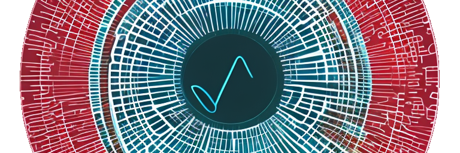

# Table of Contents

1.  [Installation](#org8e2e1ee)
2.  [Notes](#org88d7ed4)
3.  [Reference](#org59f1579)
    1.  [Public methods](#orgf8d976a)
        1.  [`FFT.fft(data: Array<float>) -> Array<Complex>`](#org82c6d20)
        2.  [`FFT.ifft(data: Array<Complex>) -> Array<Complex>`](#org8f8ba68)
        3.  [`FFT.reals(data: Array<Complex>) -> Array<float>`](#org2446d66)
        4.  [`FFT.imags(data: Array<Complex>) -> Array<float>`](#org38e4f06)
        5.  [`FFT.ensure_complex(data: Array<MaybeComplex>) -> Array<Complex>`](#orgb19154d)
    2.  [Internal methods](#orgae1faf8)
        1.  [`FFT.conjugate(amplitudes: Array<Complex>) -> Array<Complex>`](#org757ca89)
        2.  [`FFT.keyed(data: Array<Dictionary>, key: String) -> Data<Any>`](#orgf908bfc)

[](https://github.com/godotengine/awesome-godot)


Fast Fourier Transform in GDScript

Mostly modified from [The javascript FFT on rosetta code](https://rosettacode.org/wiki/Fast_Fourier_transform#JavaScript).

<a id="org8e2e1ee"></a>

# Installation

1.  Install addon
2.  Enable plugin from the project-settings

The singleton `FFT` is autoloaded at your project start, so you can simply call the static functionality as shown below.

```gdscript
    var result = FFT.fft([1, 1, 1, 1, 0, 0, 0, 0])
    result = FFT.fft(result)

    for item in result:
    	item.log()
```

<a id="org88d7ed4"></a>

# Notes

This is an in-place modification for speed, so if you want to ensure functional purity you can duplicate your data array before passing it into the `fft` or `ifft` functionality. The data array is also returned.

```gdscript
    var my_arr = [1, 1, 1, 1, 0, 0, 0, 0]
    var result = FFT.fft(my_arr.duplicate(true))
    # my_arr remains unchanged
```

<a id="org59f1579"></a>

# Reference

<a id="orgf8d976a"></a>

## Public methods

<a id="org82c6d20"></a>

### `FFT.fft(data: Array<float>) -> Array<Complex>`

Forward transformation from data-space into fourier-space.

<a id="org8f8ba68"></a>

### `FFT.ifft(data: Array<Complex>) -> Array<Complex>`

Reverse transformation from fourier-space into data-space.

<a id="org2446d66"></a>

### `FFT.reals(data: Array<Complex>) -> Array<float>`

Returns the real part of each data point.

<a id="org38e4f06"></a>

### `FFT.imags(data: Array<Complex>) -> Array<float>`

Returns the imaginary part of each data point.

<a id="orgb19154d"></a>

### `FFT.ensure_complex(data: Array<MaybeComplex>) -> Array<Complex>`

Ensure that all data items in the array are Complex numbers.

<a id="orgae1faf8"></a>

## Internal methods

<a id="org757ca89"></a>

### `FFT.conjugate(amplitudes: Array<Complex>) -> Array<Complex>`

Flips the sign of each amplitude

<a id="orgf908bfc"></a>

### `FFT.keyed(data: Array<Dictionary>, key: String) -> Data<Any>`

Returns data[idx][key] for each index.

<a href="https://www.buymeacoffee.com/tavurth" target="_blank"></a>
